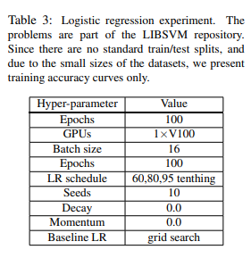
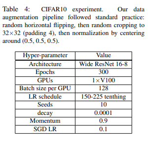
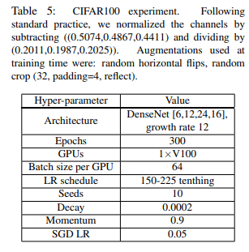
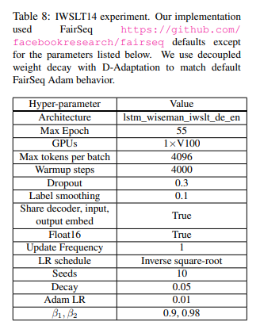

[](https://classroom.github.com/a/fEFF99tU)
[](https://classroom.github.com/online_ide?assignment_repo_id=12814376&assignment_repo_type=AssignmentRepo)

# On the reproducibility of “Learning-Rate-Free Learning by D-Adaptation”

Welcome to our repository. Her you will find information about:

- [**Repository Structure**](#repository-structure)
- [**Reproducing our Results**](#reproducing-our-results)
- [**Training and Model Configurations**](#training-and-model-configurations)
## Repository Structure

```
.
├── data
│   └── regression_experiments 
│       └── raw
│           └── libsvm
|                └── ... #Contains data for Logistic regression experiments, which must be downloaded from original source
├── fairseq_dadaptation_module
|   └── ... #Contains our wrapper of D-Adapation in the Fairseq framework for NLP (Text translation) experiments.
├── nlp_experiments
│   ├── plots
│   ├── adam_results
│   ├── dadapt_results
│   ├── data-bin
|   └── ... #Contains scripts to run training and pre-tokenized data. In order to regenerate pre-tokenized data, please consult Fairseq docs.
├── regression_experiments
│   ├── plots
│   ├──results
|   └── ... #Contains scripts to run training.
└── vision_experiments
|   ├── plots
|   ├── results
|   └── ... #Contains scripts to download data and run training.
└── reproduced_paper_images
    └── ... #Contains images from the original paper that we replicate in our work. 
```


## Reproducing our results:

### Preparing the environment

You can prepare the environment used in this project by running 

```
conda env create -f environment.yml
conda activate ml_project2_ml_hype
python -m pip install -r requirements.txt
```

### Running Logistic Regression Experiments

On a bash terminal, you can run an example of one of our Logistic Regression Experiments with the following command.

```
./run_experiment.sh 'logistic-regression'
```

### Running Image Classification Experiments

On a bash terminal, you can run an example of one of our Logistic Regression Experiments with the following command.

```
./run_experiment.sh 'image-classification'
```

### Running Text translation Experiment

```
./run_experiment.sh 'text-translation'
```

## Training and model configurations. 

The configurations of each one of our experiments mirror the reproduced paper and are described below:

* Logistic Regression configuration (reproduced from original paper):
  


* CIFAR10 experiment configuration (reproduced from original paper):
  


* CIFAR100 experiment configuration (reproduced from original paper):
  


* Translation experiment configuration (reproduced from original paper):
  

